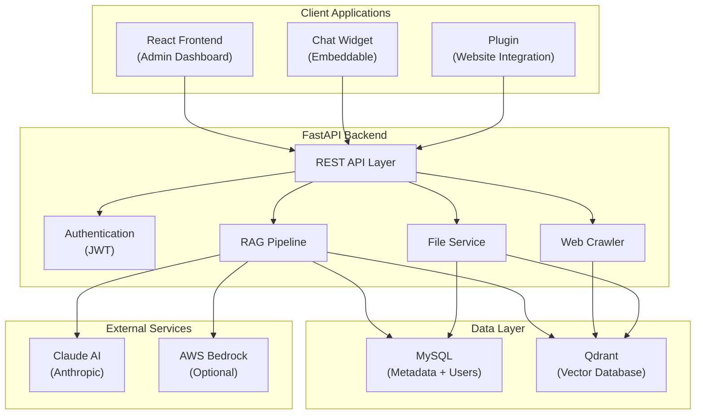
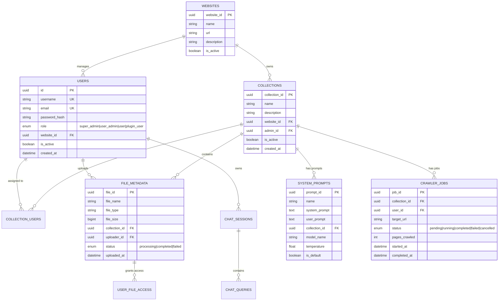

# 🤖 RAG Chatbot System - Complete Technical Documentation

**Version:** 1.0  
**Last Updated:** January 2026  

This document provides a comprehensive technical overview of the Collection-Based RAG (Retrieval-Augmented Generation) Chatbot System, covering architecture, components, workflows, and implementation details.

---

## Table of Contents

1. [System Overview](#1-system-overview)
2. [Architecture](#2-architecture)
3. [Technology Stack](#3-technology-stack)
4. [Backend Components](#4-backend-components)
5. [Frontend Components](#5-frontend-components)
6. [Chat Widget & Plugin](#6-chat-widget--plugin)
7. [RAG Pipeline](#7-rag-pipeline)
8. [Database Schema](#8-database-schema)
9. [Vector Database](#9-vector-database)
10. [Web Crawler](#10-web-crawler)
11. [Authentication & Authorization](#11-authentication--authorization)
12. [API Reference](#12-api-reference)
13. [Configuration](#13-configuration)
14. [Deployment](#14-deployment)

---

## 1. System Overview

### 1.1 What is this System?

The RAG Chatbot System is a **production-ready, multi-tenant chatbot platform** that uses Retrieval-Augmented Generation to provide accurate, context-aware responses based on your organization's knowledge base.

### 1.2 Key Capabilities

| Feature | Description |
|---------|-------------|
| **Collection-Based Architecture** | Single vector database logically divided into isolated collections |
| **Multi-Tenant Support** | Multiple organizations/websites with complete data isolation |
| **Role-Based Access Control** | Super Admin, Collection Admin, User, Plugin User roles |
| **AI-Powered Responses** | Claude AI integration for natural language responses |
| **Web Crawler** | Automated website content ingestion with intelligent extraction |
| **Document Processing** | PDF, DOCX, PPTX, XLSX, TXT, CSV support |
| **Real-time Chat** | Streaming responses with typing animations |
| **Embeddable Widget** | Standalone chat widget for third-party websites |
| **Plugin System** | Seamless integration into existing web applications |

### 1.3 System Components

```
┌─────────────────────────────────────────────────────────────────────────────┐
│                           RAG CHATBOT SYSTEM                                │
├─────────────────────────────────────────────────────────────────────────────┤
│                                                                             │
│   ┌──────────────┐   ┌──────────────┐   ┌──────────────┐   ┌────────────┐  │
│   │   Frontend   │   │  Chat Widget │   │    Plugin    │   │   Backend  │  │
│   │   (React)    │   │   (Vanilla)  │   │ (Embeddable) │   │  (FastAPI) │  │
│   └──────┬───────┘   └──────┬───────┘   └──────┬───────┘   └──────┬─────┘  │
│          │                  │                  │                  │        │
│          └──────────────────┼──────────────────┴──────────────────┘        │
│                             │                                               │
│                    ┌────────▼────────┐                                     │
│                    │    REST API     │                                     │
│                    │  (FastAPI + JWT)│                                     │
│                    └────────┬────────┘                                     │
│                             │                                               │
│          ┌──────────────────┼──────────────────┐                           │
│          │                  │                  │                           │
│   ┌──────▼──────┐   ┌───────▼──────┐   ┌──────▼──────┐                    │
│   │    MySQL    │   │    Qdrant    │   │  Claude AI  │                    │
│   │  (Metadata) │   │   (Vectors)  │   │   (LLM)     │                    │
│   └─────────────┘   └──────────────┘   └─────────────┘                    │
│                                                                             │
└─────────────────────────────────────────────────────────────────────────────┘
```

---

## 2. Architecture

### 2.1 High-Level Architecture



### 2.2 Data Flow

```
User Query → Frontend/Widget → API Gateway → Authentication
                                                    ↓
                                            RAG Pipeline
                                                    ↓
                           ┌────────────────────────┼────────────────────────┐
                           ↓                        ↓                        ↓
                    Query Expansion           Vector Search            Context Retrieval
                           ↓                        ↓                        ↓
                           └────────────────────────┼────────────────────────┘
                                                    ↓
                                            Chunk Scoring & Filtering
                                                    ↓
                                            Context Assembly
                                                    ↓
                                            LLM Generation (Claude)
                                                    ↓
                                            Streaming Response → User
```

### 2.3 Request Lifecycle

1. **Request Arrives**: Client sends HTTP request to FastAPI backend
2. **Authentication**: JWT token validated via middleware
3. **Route Handler**: Request routed to appropriate endpoint
4. **Business Logic**: Controller executes business logic
5. **Database Operations**: MySQL for metadata, Qdrant for vectors
6. **AI Processing**: For chat requests, RAG pipeline invoked
7. **Response**: JSON or SSE stream returned to client

---

## 3. Technology Stack

### 3.1 Backend

| Component | Technology | Purpose |
|-----------|------------|---------|
| **Framework** | FastAPI (Python 3.8+) | High-performance async API |
| **Database** | MySQL 8.0 | Relational data storage |
| **Vector DB** | Qdrant | Semantic similarity search |
| **AI Provider** | Claude (Anthropic) / AWS Bedrock | Natural language generation |
| **Embeddings** | Sentence Transformers (all-MiniLM-L6-v2) | Text vectorization |
| **Auth** | JWT (python-jose) | Token-based authentication |
| **ORM** | SQLAlchemy | Database abstraction |
| **Web Scraping** | aiohttp, BeautifulSoup | Async web crawling |

### 3.2 Frontend

| Component | Technology | Purpose |
|-----------|------------|---------|
| **Framework** | React 18 + TypeScript | UI development |
| **Build Tool** | Vite | Fast development/bundling |
| **Styling** | Tailwind CSS | Utility-first CSS |
| **UI Components** | shadcn/ui | Modern component library |
| **Routing** | React Router v6 | Client-side navigation |
| **State** | React Context | Global state management |

### 3.3 Chat Widget

| Component | Technology | Purpose |
|-----------|------------|---------|
| **Core** | Vanilla JavaScript | No framework dependencies |
| **Styling** | CSS3 | Standalone styles |
| **Bundling** | Rollup | Minimal bundle size |

---

## 4. Backend Components

### 4.1 Directory Structure

```
chatbot_backend/
├── app/
│   ├── api/                    # API route handlers
│   │   ├── routes_auth.py      # Authentication endpoints
│   │   ├── routes_chat.py      # Chat/RAG endpoints  
│   │   ├── routes_collections.py # Collection management
│   │   ├── routes_crawler.py   # Web crawler control
│   │   ├── routes_files.py     # File upload/management
│   │   ├── routes_health.py    # Health checks
│   │   ├── routes_plugins.py   # Plugin integrations
│   │   ├── routes_prompts.py   # System prompts
│   │   └── routes_websites.py  # Website/tenant management
│   │
│   ├── core/                   # Core business logic
│   │   ├── auth.py             # JWT handling
│   │   ├── database.py         # DB connection
│   │   ├── embeddings.py       # Vector embeddings
│   │   ├── permissions.py      # RBAC logic
│   │   ├── rag.py              # RAG pipeline (main)
│   │   └── vectorstore.py      # Qdrant interface
│   │
│   ├── models/                 # SQLAlchemy models
│   │   ├── user.py             # User model
│   │   ├── collection.py       # Collection model
│   │   ├── file_metadata.py    # File metadata
│   │   ├── system_prompt.py    # Prompt templates
│   │   ├── crawler_job.py      # Crawler job tracking
│   │   └── ...
│   │
│   ├── services/               # Business services
│   │   ├── crawler/            # Crawler engine modules
│   │   ├── crawler_service.py  # Crawler orchestration
│   │   ├── chat_tracking.py    # Session management
│   │   ├── activity_tracker.py # Audit logging
│   │   └── health_monitor.py   # System health
│   │
│   ├── config.py               # Configuration management
│   └── main.py                 # Application entry point
│
├── requirements.txt            # Python dependencies
└── .env                        # Environment variables
```

### 4.2 Core Modules

#### 4.2.1 RAG Pipeline (`app/core/rag.py`)

The RAG (Retrieval-Augmented Generation) pipeline is the heart of the chatbot:

```python
class RAG:
    """Main RAG orchestrator handling query → response flow."""
    
    def retrieve_chunks(self, query: str, top_k: int = 5, collection_id: str = None):
        """
        1. Expand query (synonyms, variations)
        2. Search Qdrant for similar chunks
        3. Apply keyword boosting
        4. Filter by score threshold
        5. Return ranked results
        """
    
    def answer_with_context(self, query: str, chunks: list, conversation_history: list):
        """
        1. Assemble context from chunks
        2. Format system prompt
        3. Include conversation history
        4. Call Claude/Bedrock API
        5. Stream response tokens
        """
    
    def needs_followup(self, question: str, chunks: list):
        """Detect ambiguous queries requiring clarification."""
```

**Key Features:**
- Query expansion for better recall
- Hybrid scoring (vector + keyword)
- Configurable thresholds (`RAG_MIN_SCORE`, `SOURCE_MIN_SCORE`)
- Conversation history summarization
- Follow-up question generation

#### 4.2.2 Vector Store (`app/core/vectorstore.py`)

```python
class VectorStore:
    """Qdrant interface for vector operations."""
    
    def add_documents_with_metadata(self, documents: list):
        """Bulk insert documents with embeddings and metadata."""
    
    def search(self, query: str, top_k: int, collection_id: str = None):
        """Semantic similarity search with optional collection filter."""
    
    def delete_documents_by_file_id(self, file_id: str):
        """Remove all chunks associated with a file."""
```

#### 4.2.3 Authentication (`app/core/auth.py`)

```python
# JWT token generation and validation
def create_access_token(data: dict) -> str
def get_current_user(token: str) -> dict
def verify_password(plain_password: str, hashed_password: str) -> bool
def get_password_hash(password: str) -> str
```

### 4.3 API Routes Summary

| Module | Prefix | Purpose |
|--------|--------|---------|
| `routes_auth.py` | `/auth` | Login, token management |
| `routes_chat.py` | `/chat` | Chat queries, sessions |
| `routes_collections.py` | `/collections` | Knowledge base management |
| `routes_crawler.py` | `/crawler` | Web crawling jobs |
| `routes_files.py` | `/files` | Document upload/processing |
| `routes_plugins.py` | `/plugins` | Widget integrations |
| `routes_prompts.py` | `/prompts` | AI prompt templates |
| `routes_health.py` | `/health` | System health checks |
| `routes_websites.py` | `/websites` | Tenant management |

---

## 5. Frontend Components

### 5.1 Directory Structure

```
chatbot_frontend/src/
├── components/
│   ├── ui/                     # shadcn/ui components
│   ├── AppSidebar.tsx          # Main navigation sidebar
│   ├── CrawlerView.tsx         # Web crawler interface
│   ├── DashboardLayout.tsx     # Layout wrapper
│   └── ThemeToggle.tsx         # Dark/light mode switch
│
├── pages/
│   ├── Login.tsx               # Authentication page
│   ├── superadmin/             # Super admin pages
│   │   ├── Dashboard.tsx       # Overview dashboard
│   │   ├── Collections.tsx     # Collection management
│   │   ├── Users.tsx           # User management
│   │   ├── Prompts.tsx         # Prompt configuration
│   │   └── SuperadminChat.tsx  # Admin chat interface
│   │
│   ├── useradmin/              # Collection admin pages
│   │   ├── Dashboard.tsx       # Admin dashboard
│   │   ├── UserAdminChat.tsx   # Chat interface
│   │   └── Plugins.tsx         # Plugin management
│   │
│   ├── user/                   # Regular user pages
│   │   └── UserChat.tsx        # User chat interface
│   │
│   └── pluginuser/             # Plugin user pages
│       └── PluginUserChat.tsx  # Embedded chat
│
├── contexts/
│   └── AuthContext.tsx         # Authentication state
│
├── utils/
│   ├── api.ts                  # API client utilities
│   └── storage.ts              # Local storage helpers
│
└── App.tsx                     # Main app + routing
```

### 5.2 Key Pages

#### 5.2.1 Dashboard
- System overview with statistics cards
- Recent activity feed
- Quick access to common actions

#### 5.2.2 Collections Management
- Create/edit/delete knowledge bases
- Assign admins and users
- Configure collection settings
- View collection statistics

#### 5.2.3 Chat Interface
- Real-time AI chat with streaming responses
- Session management (new chat, history)
- Source citations with confidence scores
- Message actions (copy, delete)

#### 5.2.4 Web Crawler
- Start new crawl jobs
- Configure crawl parameters (depth, patterns)
- Monitor crawl progress in real-time
- View/export crawled content

---

## 6. Chat Widget & Plugin

### 6.1 Chat Widget (`Chat_widget/`)

A standalone, embeddable chat interface:

```
Chat_widget/
├── index.html      # Demo page
├── app.js          # Main application logic (~40KB)
├── config.js       # Configuration options
├── styles.css      # Widget styling
└── leto.svg        # Bot avatar
```

**Features:**
- Zero dependencies (vanilla JS)
- Responsive design
- Dark/light theme support
- Session persistence
- Markdown rendering
- Mobile-friendly

**Embedding:**
```html
<link rel="stylesheet" href="https://your-domain/widget/styles.css">
<script src="https://your-domain/widget/app.js"></script>
```

### 6.2 Plugin System (`chatbot_plugin/`)

Full-featured embeddable plugin:

```
chatbot_plugin/
├── src/
│   ├── index.js        # Main plugin entry
│   ├── auth.js         # Authentication handling
│   ├── chat.js         # Chat functionality
│   ├── ui.js           # UI components
│   ├── config.js       # Configuration
│   └── styles.css      # Plugin styles
│
├── rollup.config.js    # Bundle configuration
└── package.json        # Dependencies
```

**Features:**
- Auto-authentication via plugin tokens
- Full chat history
- Source citations
- Session management
- Thinking animations
- Background request handling

---

## 7. RAG Pipeline

### 7.1 How RAG Works

```
┌─────────────────────────────────────────────────────────────────────────────┐
│                              RAG PIPELINE                                   │
├─────────────────────────────────────────────────────────────────────────────┤
│                                                                             │
│  1. QUERY PROCESSING                                                        │
│     ┌──────────────┐                                                        │
│     │ User Query   │ → Query Expansion → "who is john" becomes:            │
│     │ "who is john"│   • "who is john"                                     │
│     └──────────────┘   • "john" (entity extraction)                        │
│                        • "john contact" (augmented)                         │
│                                                                             │
│  2. VECTOR SEARCH                                                           │
│     ┌──────────────┐                                                        │
│     │ Embedding    │ → Query embedded using all-MiniLM-L6-v2               │
│     │ Generation   │   (384-dimensional vectors)                           │
│     └──────────────┘                                                        │
│            ↓                                                                │
│     ┌──────────────┐                                                        │
│     │ Qdrant       │ → Cosine similarity search                            │
│     │ Search       │   Collection-filtered, top-k results                  │
│     └──────────────┘                                                        │
│                                                                             │
│  3. SCORING & RANKING                                                       │
│     ┌──────────────┐                                                        │
│     │ Hybrid       │ → Vector score + Keyword boost                        │
│     │ Scoring      │   Names/titles get extra weight                       │
│     └──────────────┘                                                        │
│            ↓                                                                │
│     ┌──────────────┐                                                        │
│     │ Filtering    │ → RAG_MIN_SCORE threshold (default: 0.25)             │
│     │              │ → SOURCE_MIN_SCORE for UI (default: 0.40)             │
│     └──────────────┘                                                        │
│                                                                             │
│  4. CONTEXT ASSEMBLY                                                        │
│     ┌──────────────┐                                                        │
│     │ Chunks +     │ → Top chunks assembled into context                   │
│     │ History      │ → Last 10 conversation messages included              │
│     └──────────────┘ → Token limit enforced (MAX_CONTEXT_TOKENS)           │
│                                                                             │
│  5. LLM GENERATION                                                          │
│     ┌──────────────┐                                                        │
│     │ Claude AI    │ → System prompt + Context + Query → Response          │
│     │ (Streaming)  │   Streamed token-by-token to client                   │
│     └──────────────┘                                                        │
│                                                                             │
└─────────────────────────────────────────────────────────────────────────────┘
```

### 7.2 Chunking Strategy

Documents are split into semantic chunks for vectorization:

| Parameter | Default | Description |
|-----------|---------|-------------|
| Chunk Size | 500 chars | Maximum characters per chunk |
| Overlap | 50 chars | Overlap between adjacent chunks |
| Min Chunk | 100 chars | Minimum chunk size (skip smaller) |

### 7.3 Scoring Configuration

```env
# Minimum similarity score for RAG retrieval
RAG_MIN_SCORE=0.25

# Minimum score to show source to users
SOURCE_MIN_SCORE=0.40

# Maximum context tokens sent to LLM
MAX_CONTEXT_TOKENS=4000
```

### 7.4 Follow-Up Question System

The system detects when clarification is needed:

| Trigger | Example | Action |
|---------|---------|--------|
| No chunks found | Query outside knowledge base | Ask for topic clarification |
| Low score (<0.35) | Vague match | Request more specifics |
| Ambiguous phrases | "Tell me more" | Ask what topic |
| Vague pronouns | "What is it?" | Request referent |

---

## 8. Database Schema

### 8.1 Entity Relationship Diagram



### 8.2 Core Tables

| Table | Purpose |
|-------|---------|
| `users` | User accounts and authentication |
| `websites` | Tenant/organization definitions |
| `collections` | Knowledge base containers |
| `collection_users` | User-collection membership |
| `system_prompts` | AI prompt configurations |
| `file_metadata` | Uploaded document tracking |
| `file_binary` | Binary file storage |
| `user_file_access` | Per-file permissions |
| `chat_sessions` | Conversation sessions |
| `chat_queries` | Individual messages |
| `query_logs` | Analytics and audit |
| `crawler_jobs` | Web crawl job tracking |
| `activity_logs` | System activity audit |

---

## 9. Vector Database

### 9.1 Qdrant Configuration

The system uses Qdrant for vector storage and similarity search:

```python
# Connection configuration
VECTOR_DB_URL = "http://localhost:6333"
COLLECTION_NAME = "kb_docs"

# Vector configuration
VECTOR_SIZE = 384  # all-MiniLM-L6-v2 output dimension
DISTANCE_METRIC = "Cosine"
```

### 9.2 Document Structure

Each document chunk in Qdrant contains:

```json
{
  "id": "uuid",
  "vector": [0.123, -0.456, ...],  // 384 dimensions
  "payload": {
    "text": "The actual chunk content...",
    "file_id": "uuid",
    "collection_id": "uuid",
    "file_name": "document.pdf",
    "chunk_index": 5,
    "source_url": "https://example.com/page",
    "crawl_job_id": "uuid",  // If from crawler
    "title": "Page Title",
    "created_at": "2026-01-20T10:00:00Z"
  }
}
```

### 9.3 Search Operations

```python
# Basic search with collection filter
results = vectorstore.search(
    query="How do I reset password?",
    top_k=5,
    collection_id="col_123",
    score_threshold=0.25
)

# Delete by file
vectorstore.delete_documents_by_file_id("file_123")

# Delete by crawl job
vectorstore.delete_documents_by_crawl_job_id("job_456")
```

---

## 10. Web Crawler

### 10.1 Crawler Architecture

```
chatbot_backend/app/services/crawler/
├── crawler_engine.py       # Main crawl orchestrator
├── html_fetcher.py         # Async HTTP fetching
├── content_extractor.py    # Main content detection
├── document_extractor.py   # PDF/DOCX extraction
├── chunker.py              # Text chunking
├── sitemap_parser.py       # Sitemap discovery
├── duplicate_detector.py   # Near-duplicate detection
└── config.py               # Crawler configuration
```

### 10.2 Crawl Process

```
Start URL → Sitemap Check → URL Queue
                               ↓
                         HTML Fetcher
                               ↓
                         Content Extractor
                         (Boilerplate removal)
                               ↓
                         Document Extractor
                         (PDF/DOCX if linked)
                               ↓
                         Duplicate Detection
                               ↓
                         Text Chunking
                               ↓
                         Vector Embedding
                               ↓
                         Qdrant Storage
```

### 10.3 Crawl Configuration

| Parameter | Default | Description |
|-----------|---------|-------------|
| `max_pages` | 100 | Maximum pages to crawl |
| `max_depth` | 5 | Maximum link depth from start |
| `use_sitemap` | true | Parse sitemap.xml if available |
| `process_documents` | true | Extract PDFs/DOCs found |
| `exclude_patterns` | [] | URL patterns to skip |
| `include_keywords` | [] | Required keywords in content |

### 10.4 Content Extraction

The crawler uses DOM scoring to identify main content:

```python
# Content scoring factors
POSITIVE_SIGNALS = ['article', 'main', 'content', 'post', 'entry']
NEGATIVE_SIGNALS = ['nav', 'sidebar', 'header', 'footer', 'menu', 'ad']

# Score calculation
score = (
    text_length * 0.3 +
    paragraph_count * 0.3 +
    link_density_penalty * 0.2 +
    class_score * 0.2
)
```

---

## 11. Authentication & Authorization

### 11.1 JWT Token Flow

```
┌─────────────┐     ┌─────────────┐     ┌─────────────┐
│   Login     │ --> │  Validate   │ --> │   Generate  │
│  Request    │     │ Credentials │     │  JWT Token  │
└─────────────┘     └─────────────┘     └──────┬──────┘
                                               │
      ┌────────────────────────────────────────┘
      ↓
┌─────────────┐     ┌─────────────┐     ┌─────────────┐
│   Client    │ --> │   Include   │ --> │   Backend   │
│   Stores    │     │  in Header  │     │  Validates  │
│   Token     │     │ Authorization│    │   Token     │
└─────────────┘     └─────────────┘     └─────────────┘
```

### 11.2 Token Configuration

```env
SECRET_KEY=your-secret-key-here
ALGORITHM=HS256
ACCESS_TOKEN_EXPIRE_MINUTES=30
PLUGIN_TOKEN_EXPIRE_DAYS=30
```

### 11.3 User Roles

| Role | Permissions |
|------|-------------|
| **super_admin** | Full system access, manage all tenants, users, collections |
| **user_admin** | Manage users and files within assigned website/collection |
| **user** | Chat access, view accessible files only |
| **plugin_user** | API-only access via plugin token for specific collection |

### 11.4 Permission Matrix

| Action | Super Admin | User Admin | User | Plugin User |
|--------|:-----------:|:----------:|:----:|:-----------:|
| Create Collections | ✅ | ❌ | ❌ | ❌ |
| Manage All Users | ✅ | ❌ | ❌ | ❌ |
| Manage Own Users | ✅ | ✅ | ❌ | ❌ |
| Upload Files | ✅ | ✅ | ❌ | ❌ |
| Start Crawler | ✅ | ✅ | ❌ | ❌ |
| Chat | ✅ | ✅ | ✅ | ✅ |
| View Analytics | ✅ | ✅ | ❌ | ❌ |
| Configure Prompts | ✅ | ✅ | ❌ | ❌ |

---

## 12. API Reference

### 12.1 Authentication Endpoints

| Method | Endpoint | Description |
|--------|----------|-------------|
| POST | `/auth/token` | Login and get access token |
| GET | `/auth/verify` | Validate current token |
| POST | `/auth/change-password` | Update password |
| GET | `/auth/plugin-token/verify` | Validate plugin token |
| GET | `/auth/public/token` | Get public widget token |

### 12.2 Chat Endpoints

| Method | Endpoint | Description |
|--------|----------|-------------|
| POST | `/chat/ask` | Send query with RAG (supports streaming) |
| POST | `/chat/public/ask` | Public widget queries |
| GET | `/chat/sessions` | List user's chat sessions |
| DELETE | `/chat/sessions/{session_id}` | Delete a session |
| GET | `/chat/sessions/{session_id}/messages` | Get session messages |

### 12.3 Collections Endpoints

| Method | Endpoint | Description |
|--------|----------|-------------|
| GET | `/collections/` | List accessible collections |
| POST | `/collections/` | Create new collection |
| GET | `/collections/{id}` | Get collection details |
| PUT | `/collections/{id}` | Update collection |
| DELETE | `/collections/{id}` | Delete collection |
| GET | `/collections/summary` | Lightweight list |

### 12.4 Files Endpoints

| Method | Endpoint | Description |
|--------|----------|-------------|
| POST | `/files/upload` | Upload documents |
| GET | `/files/list` | List files in collection |
| GET | `/files/metadata/{id}` | Get file details |
| DELETE | `/files/{id}` | Delete file and vectors |
| GET | `/files/{id}/download` | Download file |

### 12.5 Crawler Endpoints

| Method | Endpoint | Description |
|--------|----------|-------------|
| POST | `/crawler/start` | Start new crawl job |
| GET | `/crawler/jobs` | List crawl jobs |
| GET | `/crawler/jobs/{id}` | Get job status |
| POST | `/crawler/jobs/{id}/cancel` | Cancel running job |
| DELETE | `/crawler/jobs/{id}` | Delete job and content |
| POST | `/crawler/jobs/{id}/recrawl` | Start recrawl |

---

## 13. Configuration

### 13.1 Environment Variables

Create a `.env` file in `chatbot_backend/`:

```env
# ============================================
# AI CONFIGURATION
# ============================================
CLAUDE_API_KEY=sk-ant-...              # Anthropic API key
CLAUDE_MODEL=claude-3-haiku-20240307   # Model to use
CLAUDE_MAX_TOKENS=4096                  # Max response tokens
CLAUDE_TEMPERATURE=0.0                  # Response randomness

# AWS Bedrock (Alternative)
AI_PROVIDER=claude                      # 'claude' or 'bedrock'
AWS_REGION=us-east-1
AWS_ACCESS_KEY_ID=...
AWS_SECRET_ACCESS_KEY=...

# ============================================
# DATABASE CONFIGURATION
# ============================================
DATABASE_TYPE=mysql                     # mysql, sqlite, postgresql
DATABASE_HOST=localhost
DATABASE_PORT=3306
DATABASE_NAME=chatbot_rag
DATABASE_USER=root
DATABASE_PASSWORD=your_password
DATABASE_CHARSET=utf8mb4

# Connection Pool
DATABASE_POOL_SIZE=10
DATABASE_MAX_OVERFLOW=20
DATABASE_POOL_TIMEOUT=30

# ============================================
# VECTOR DATABASE
# ============================================
VECTOR_DB_URL=http://localhost:6333     # Qdrant URL
VECTOR_DB_FALLBACK=true                 # Enable in-memory fallback

# ============================================
# AUTHENTICATION
# ============================================
SECRET_KEY=your-super-secret-key-minimum-32-chars
ALGORITHM=HS256
ACCESS_TOKEN_EXPIRE_MINUTES=30
PLUGIN_TOKEN_EXPIRE_DAYS=30

# ============================================
# RAG CONFIGURATION
# ============================================
RAG_MIN_SCORE=0.25                      # Minimum retrieval score
SOURCE_MIN_SCORE=0.40                   # Minimum score for UI sources
MAX_CONTEXT_TOKENS=4000                 # Context token limit

# ============================================
# FILE SETTINGS
# ============================================
MAX_FILE_SIZE_MB=25
ALLOWED_FILE_TYPES=pdf,docx,pptx,xlsx,txt,csv
UPLOAD_DIR=uploads

# ============================================
# CORS CONFIGURATION
# ============================================
CORS_ORIGINS=http://localhost:3000,http://localhost:5173
CORS_METHODS=*
CORS_HEADERS=*

# ============================================
# SERVER SETTINGS
# ============================================
SERVER_HOST=0.0.0.0
SERVER_PORT=8000
DEBUG=false
```

### 13.2 Frontend Configuration

Create `.env.local` in `chatbot_frontend/`:

```env
VITE_API_URL=http://localhost:8000
VITE_APP_NAME=RAG Chatbot
```

---

## 14. Deployment

### 14.1 Development Setup

```bash
# 1. Clone repository
git clone <repository-url>
cd Chatbot_RAG_System_UI_1

# 2. Backend setup
cd chatbot_backend
python -m venv venv
venv\Scripts\activate  # Windows
source venv/bin/activate  # Linux/Mac
pip install -r requirements.txt
cp .env.example .env
# Edit .env with your settings
python -m uvicorn app.main:app --reload

# 3. Frontend setup (new terminal)
cd chatbot_frontend
npm install
npm run dev
```

### 14.2 Production Deployment

#### Backend (Docker)

```dockerfile
FROM python:3.11-slim

WORKDIR /app

COPY requirements.txt .
RUN pip install --no-cache-dir -r requirements.txt

COPY . .

EXPOSE 8000

CMD ["uvicorn", "app.main:app", "--host", "0.0.0.0", "--port", "8000"]
```

#### Frontend (Build)

```bash
cd chatbot_frontend
npm run build
# Deploy dist/ folder to static hosting (Nginx, CDN, etc.)
```

### 14.3 Required Services

| Service | Purpose | Default Port |
|---------|---------|--------------|
| **FastAPI Backend** | API server | 8000 |
| **MySQL** | Relational database | 3306 |
| **Qdrant** | Vector database | 6333 |
| **Frontend** | React app | 3000 (dev) / 80 (prod) |

### 14.4 Default Credentials

> ⚠️ **Change these immediately in production!**

| Role | Username | Password |
|------|----------|----------|
| Super Admin | `superadmin` | `superadmin123` |
| User Admin | `admin` | `admin123` |
| User | `user` | `user123` |

---

## Additional Resources

- [API Documentation](file:///c:/Users/nivin/Documents/Chatbot_RAG_System_UI_1/API_DOCUMENTATION.md) - Full API reference
- [README](file:///c:/Users/nivin/Documents/Chatbot_RAG_System_UI_1/README.md) - Quick start guide
- [Backend README](file:///c:/Users/nivin/Documents/Chatbot_RAG_System_UI_1/chatbot_backend/README.md) - Backend-specific docs
- [Frontend README](file:///c:/Users/nivin/Documents/Chatbot_RAG_System_UI_1/chatbot_frontend/README.md) - Frontend setup

---

*This documentation is auto-generated and should be kept in sync with code changes.*
